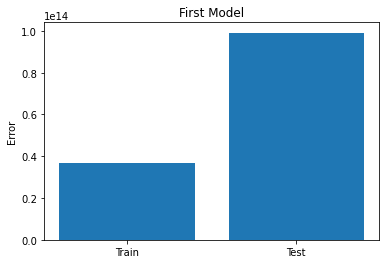

# Kaggle Starter Code

In this notebook, we walk through a basic workflow for participating in a kaggle competition. 

Specifically, we will:

* Train a model on kaggle training data.
* Handling missing values.
* Generate predictions for kaggle test data.
* Save predictions to a `.csv` file.

## Develop a model

**Import Packages**


```python
import pandas as pd
import numpy as np
import matplotlib.pyplot as plt
from sklearn.linear_model import LinearRegression
from sklearn.impute import SimpleImputer
from sklearn.metrics import mean_squared_error
from sklearn.model_selection import train_test_split

import warnings
warnings.filterwarnings("ignore")
```

**Read in training data**


```python
df = pd.read_csv('flatiron-regression-housing/training.csv')
```

**Preprocessing**


```python
# Null values are marked with the string ' -  '
# Replace this string with null values
df = df.replace(' -  ', np.nan)
# Drop null target values
df = df.dropna(subset=['SALE PRICE'])
```

**Fix datatypes**


```python
df.dtypes
```


    id                                 int64
    BOROUGH                            int64
    NEIGHBORHOOD                      object
    BUILDING CLASS CATEGORY           object
    TAX CLASS AT PRESENT              object
    BLOCK                              int64
    LOT                                int64
    EASE-MENT                         object
    BUILDING CLASS AT PRESENT         object
    ADDRESS                           object
    APARTMENT NUMBER                  object
    ZIP CODE                           int64
    RESIDENTIAL UNITS                  int64
    COMMERCIAL UNITS                   int64
    TOTAL UNITS                        int64
    LAND SQUARE FEET                  object
    GROSS SQUARE FEET                 object
    YEAR BUILT                         int64
    TAX CLASS AT TIME OF SALE          int64
    BUILDING CLASS AT TIME OF SALE    object
    SALE DATE                         object
    SALE PRICE                        object
    dtype: object


For this walkthrough, we will just use square footage as the independent variable. 

Let's convert to a float datatype.


```python
df['LAND SQUARE FEET'] = df['LAND SQUARE FEET'].astype(float)
```

Imputer null values of indepedent variable. 

**Create a train test split**


```python
model_1_df = df.copy()
X_1, y_1 = model_1_df[['LAND SQUARE FEET']], model_1_df['SALE PRICE']
X_train, X_test, y_train, y_test = train_test_split(X_1, y_1, random_state=2021)
```


```python
# Replace missing values with the median
imputer = SimpleImputer(strategy='median')
# Fit imputer to the indepedent variable
# using only the training data
imputer.fit(X_train)
# Replace missing values in the training and test data
X_train = imputer.transform(X_train)
X_test = imputer.transform(X_test)
```

**Fit a model**


```python
model_1 = LinearRegression()
model_1.fit(X_train, y_train)
```


    LinearRegression()


**Evaluate model performance**


```python
train_preds = model_1.predict(X_train)
test_preds = model_1.predict(X_test)

train_score = mean_squared_error(y_train, train_preds)
test_score = mean_squared_error(y_test, test_preds)

print('Train score:', train_score)
print('Test score:', test_score)
```

    Train score: 36809480181468.875
    Test score: 99138629509997.28


```python
plt.bar(['Train', 'Test'], [train_score, test_score])
plt.ylabel('Error')
plt.title('First Model');
```


    

    


## Create submission predictions

Kaggle competitions will always provide you with a `test` dataset that contains all of the independent variables in the training data, *but does not contain the target column.* 

The idea is that you want to build a model using the training data so it can predict accurately when we do not know the target value.

**Import testing data**


```python
test_df = pd.read_csv('flatiron-regression-housing/testing.csv')
```


```python
test_df.head(2)
```


<div>
<style scoped>
    .dataframe tbody tr th:only-of-type {
        vertical-align: middle;
    }

    .dataframe tbody tr th {
        vertical-align: top;
    }

    .dataframe thead th {
        text-align: right;
    }
</style>
<table border="1" class="dataframe">
  <thead>
    <tr style="text-align: right;">
      <th></th>
      <th>id</th>
      <th>BOROUGH</th>
      <th>NEIGHBORHOOD</th>
      <th>BUILDING CLASS CATEGORY</th>
      <th>TAX CLASS AT PRESENT</th>
      <th>BLOCK</th>
      <th>LOT</th>
      <th>EASE-MENT</th>
      <th>BUILDING CLASS AT PRESENT</th>
      <th>ADDRESS</th>
      <th>...</th>
      <th>ZIP CODE</th>
      <th>RESIDENTIAL UNITS</th>
      <th>COMMERCIAL UNITS</th>
      <th>TOTAL UNITS</th>
      <th>LAND SQUARE FEET</th>
      <th>GROSS SQUARE FEET</th>
      <th>YEAR BUILT</th>
      <th>TAX CLASS AT TIME OF SALE</th>
      <th>BUILDING CLASS AT TIME OF SALE</th>
      <th>SALE DATE</th>
    </tr>
  </thead>
  <tbody>
    <tr>
      <th>0</th>
      <td>52192</td>
      <td>4</td>
      <td>BELLE HARBOR</td>
      <td>01 ONE FAMILY DWELLINGS</td>
      <td>1</td>
      <td>16261</td>
      <td>68</td>
      <td></td>
      <td>A2</td>
      <td>446 BEACH 139TH STREET</td>
      <td>...</td>
      <td>11694</td>
      <td>1</td>
      <td>0</td>
      <td>1</td>
      <td>4000</td>
      <td>2145</td>
      <td>1960</td>
      <td>1</td>
      <td>A2</td>
      <td>2017-06-21 00:00:00</td>
    </tr>
    <tr>
      <th>1</th>
      <td>18587</td>
      <td>2</td>
      <td>BAYCHESTER</td>
      <td>02 TWO FAMILY DWELLINGS</td>
      <td>1</td>
      <td>4775</td>
      <td>41</td>
      <td></td>
      <td>B1</td>
      <td>3026 WICKHAM AVENUE</td>
      <td>...</td>
      <td>10469</td>
      <td>2</td>
      <td>0</td>
      <td>2</td>
      <td>2700</td>
      <td>2880</td>
      <td>1960</td>
      <td>1</td>
      <td>B1</td>
      <td>2017-06-30 00:00:00</td>
    </tr>
  </tbody>
</table>
<p>2 rows × 21 columns</p>
</div>


```python
test_df = test_df.replace(' -  ', np.nan)
```

**Repeat the same preprocessing**


```python
test_X = test_df[['LAND SQUARE FEET']]

test_X = imputer.transform(test_X)
```

**Create final predictions**


```python
final_preds = model_1.predict(test_X)
```

**Save predictions**

*The kaggle competition provides the following instructions for submitting predictions:*

----------

Your submission should be in the form a csv file with two columns. 
1. `id`
2. `target`

The `id` column should be the `id` column found in the predictors dataset.

**For example,** if I were to submit a csv of predictions where I predict the mean for every observations, the first three rows of the submission would look like this:

| id    | target  |
|-------|---------|
| 25427 | 1294634 |
| 71461 | 1294634 |
| 20636 | 1294634 |


***It is recommended that you save your predictions to csv using `pd.to_csv` and that you import the saved file into a notebook, to make sure the file is structured as intended.***

--------

The easiest way to do this, is to add the predictions to the original dataframe and then isolate the columns we want. 


```python
# Add predictions to the test dataframe
test_df['target'] = final_preds
# Isolate the columns we want in our submission
submission_df = test_df[['id', 'target']]
```

Check the shape. The shape of our submission *must* be `(14955, 2)`


```python
submission_df.shape
```


    (14955, 2)


**Now we just need to save the submission to a `.csv` file.**

In this case, you should set `index=False`.


```python
submission_df.to_csv('joél_submission.csv', index=False)
```

## Submit Predictions

Once you have saved you predictions to a csv file, you can submit them [here](https://www.kaggle.com/c/flatiron-regression-housing/submit)
